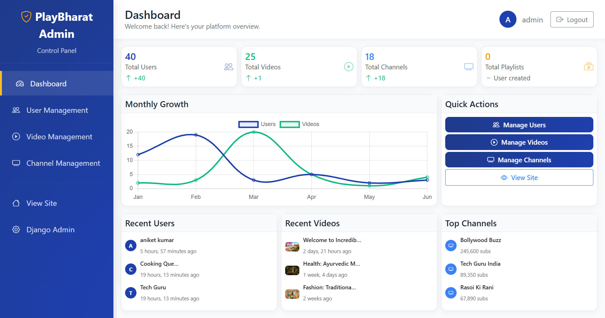

# 🎬 PlayBharat - Premium Video Streaming Platform

> **The Ultimate Video Content Platform for Creators & Viewers**

[](https://djangoproject.com/)
[](https://python.org/)
[](https://getbootstrap.com/)
[](LICENSE)
[](https://github.com/DevAniketIT/Playbharat)

**PlayBharat** is a cutting-edge video streaming platform that revolutionizes how creators share content and audiences discover amazing videos. Built with modern web technologies and designed for scalability, this platform offers everything you need to launch your own video streaming service.

## 🌟 Why PlayBharat?

✨ **Production-Ready**: Fully developed and tested platform ready for deployment  
🚀 **Modern Architecture**: Built with Django 4.2.7 and latest web standards  
📱 **Responsive Design**: Perfect experience across all devices  
🔒 **Secure**: Enterprise-grade security with proper authentication  
⚡ **Fast Performance**: Optimized for speed and scalability  
🎨 **Beautiful UI**: Professional design that users love  

---

## 📸 Platform Screenshots

### 🏠 Homepage - Discover Amazing Content

*Clean, intuitive homepage showcasing trending videos and featured content*

### 📺 Video Streaming - Seamless Viewing Experience

*Professional video player with smooth streaming capabilities*

### 📈 Admin Dashboard - Complete Control

*Comprehensive admin panel for platform management and analytics*

### 👥 User Management - Powerful Admin Tools

*Advanced user management system with detailed controls*

### 🎬 Video Management - Content Control

*Complete video management system for administrators*

### 📊 Channel Management - Creator Tools

*Professional channel management interface for content creators*

### 🔥 Trending Videos - Content Discovery

*Smart trending algorithm to surface popular content*

### 🎭 Channel Details - Creator Profiles

*Beautiful channel pages showcasing creator content and information*

### 📤 Content Upload - Creator Studio

*Easy-to-use upload interface for content creators*

---

## 🚀 Key Features & Capabilities

### 🎥 **Core Video Platform**
- **HD Video Streaming**: High-quality video playback with adaptive streaming
- **Smart Upload System**: Drag-and-drop video uploads with progress tracking
- **Video Processing**: Automatic thumbnail generation and video optimization
- **Multi-Format Support**: MP4, AVI, MOV, WebM and more video formats
- **Responsive Player**: Custom video player that works on all devices

### 👥 **User & Channel Management**
- **User Authentication**: Secure registration, login with email verification
- **Channel Creation**: Professional channel setup with avatars and banners
- **Profile Customization**: Rich user profiles with bio, social links
- **Creator Dashboard**: Comprehensive analytics and content management
- **Subscription System**: Follow favorite creators and get notifications

### 📈 **Advanced Admin Panel**
- **Complete Admin Control**: Manage users, videos, channels from single dashboard
- **Content Moderation**: Review, approve, or remove inappropriate content
- **User Management**: View user activities, suspend accounts, manage permissions
- **Analytics Dashboard**: Platform statistics, growth metrics, engagement data
- **Bulk Operations**: Perform actions on multiple items simultaneously

### 🔍 **Smart Discovery**
- **Advanced Search**: Find videos by title, description, tags, or creator
- **Trending Algorithm**: Automatically surface popular and engaging content
- **Category Filtering**: Browse content by entertainment, music, education, etc.
- **Personalized Recommendations**: Smart suggestions based on viewing history
- **Featured Content**: Highlight special videos and creators

### 🌐 **Global Ready Features**
- **Multi-Language Support**: Hindi, Tamil, Telugu, Bengali and 8+ languages
- **Responsive Design**: Perfect on desktop, tablet, and mobile devices
- **SEO Optimized**: Better discoverability in search engines
- **Fast Loading**: Optimized performance for users worldwide
- **Social Sharing**: Share videos across social media platforms

### 🔒 **Enterprise Security**
- **Data Protection**: Secure file uploads and user data handling
- **Authentication**: JWT-based secure authentication system
- **CSRF Protection**: Built-in security against cross-site attacks
- **Input Validation**: Comprehensive form validation and sanitization
- **Privacy Controls**: User privacy settings and data protection

---

## ⚡ Quick Start Guide

### Prerequisites
- Python 3.8+ installed
- Git for version control
- Modern web browser

### 💻 Installation Steps

1. **Clone the Repository**
   ```bash
   git clone https://github.com/DevAniketIT/Playbharat.git
   cd PlayBharat
   ```

2. **Setup Virtual Environment**
   ```bash
   python -m venv playbharat_env
   
   # Windows
   playbharat_env\Scripts\activate
   
   # Linux/Mac
   source playbharat_env/bin/activate
   ```

3. **Install Dependencies**
   ```bash
   pip install -r requirements.txt
   ```

4. **Initialize Database**
   ```bash
   python manage.py migrate
   ```

5. **Create Admin Account**
   ```bash
   python manage.py createsuperuser
   ```

6. **Launch the Platform**
   ```bash
   python manage.py runserver
   ```

7. **Access Your Platform**
   - 🏠 **Main Site**: http://127.0.0.1:8000/
   - 📈 **Admin Panel**: http://127.0.0.1:8000/control-panel/
   - 🔧 **Django Admin**: http://127.0.0.1:8000/admin/

---

## 🛠️ Technology Stack

| **Category** | **Technology** | **Purpose** |
|-------------|---------------|-------------|
| **Backend** | Django 4.2.7 | Web framework & API |
| **Database** | SQLite / PostgreSQL | Data storage |
| **Frontend** | Bootstrap 5 | Responsive UI framework |
| **Styling** | CSS3 + Custom | Modern styling |
| **JavaScript** | ES6+ | Interactive features |
| **Media** | FFmpeg | Video processing |
| **Authentication** | Django Auth | User management |
| **Deployment** | Production Ready | Scalable hosting |

---

## 💯 Platform Architecture

```
🏢 PlayBharat/
├── 💼 playbharat/        # Core project configuration
├── 👤 accounts/          # User authentication & profiles
├── 🎥 videos/            # Video upload & management
├── 📺 channels/         # Creator channels & subscriptions
├── 📈 custom_admin/      # Advanced admin dashboard
├── 🏠 home/              # Homepage & landing
├── 🔍 search/            # Search & discovery engine
├── 📡 streaming/         # Video streaming service
├── 💬 interactions/     # Comments, likes, shares
├── 🎨 templates/         # HTML templates
├── 📷 static/            # CSS, JS, images
├── 📁 media/             # User uploaded content
├── 📸 screenshots/       # Platform previews
└── ⚙️ manage.py          # Django management utility
```

---

## 🎆 What Makes PlayBharat Special?

🏆 **Production-Grade Quality**: Built with enterprise standards and best practices  
🚀 **Scalability**: Designed to handle thousands of users and videos  
🎨 **Modern UI/UX**: Beautiful, intuitive interface that users love  
🔒 **Security First**: Comprehensive security measures and data protection  
🔧 **Easy Customization**: Clean code structure for easy modifications  
🌍 **Global Ready**: Multi-language support and international standards  

---

## 📄 Usage & Permissions

### ⚠️ **Important Notice**

**This project is proprietary software. Please read carefully:**

- ❌ **No unauthorized commercial use**
- ❌ **No redistribution without permission**
- ✅ **Educational and learning purposes allowed**
- ✅ **Personal projects and portfolios allowed**
- ✅ **Modifications for learning encouraged**

### 📜 **Before Using This Project:**

1. **Contact the developer** for permission if you plan to:
   - Use commercially
   - Deploy publicly
   - Distribute or sell
   - Use in client projects

2. **Free to use for:**
   - Learning and education
   - Personal portfolio projects
   - Code study and analysis
   - Non-commercial experimentation

---

## 📧 Contact & Support

**Developer: Aniket Kumar**

- 📧 **Email**: [aniket.kumar.devpro@gmail.com](mailto:aniket.kumar.devpro@gmail.com)
- 📱 **Mobile**: +91 8318601925
- 🐈 **GitHub**: [DevAniketIT](https://github.com/DevAniketIT)
- 🌍 **Project**: [PlayBharat Repository](https://github.com/DevAniketIT/Playbharat.git)

### 🔔 **Need Help?**
- 💬 Open an issue on GitHub
- 📧 Send detailed email about your question
- 📱 WhatsApp for urgent queries

### 🔍 **Looking for Custom Development?**
- Web application development
- Django project consultation
- Video platform customization
- Full-stack development services

---

## ⭐ **Give it a Star!**

If you find PlayBharat useful, please consider giving it a star ⭐ on GitHub!

**Happy Coding! 🚀**

---

*Built with ❤️ by [Aniket Kumar](https://github.com/DevAniketIT) | © 2025 PlayBharat*
